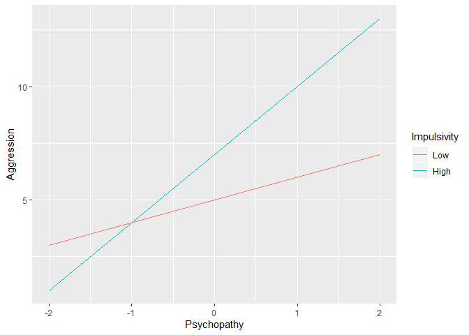

<!-- README.md is generated from README.Rmd. Please edit that file -->

# modregplot

<!-- badges: start -->

<!-- badges: end -->

The modregplot package creates simple slopes plots from a moderated
regression equation. It is useful when you are planning an analysis and
want to see what your hypothesized effects would look like. You can also
use it to see what simple slopes would look like from published findings
that have no accompanying plots.

## Installation

You can install the latest version of modregplot from
[github](https://github.com) with:

``` r
# if the remotes package is not installed, run
# install.packages("remotes")
remotes::install_github("wjschne/modregplot")
```

## Example

Suppose you see a moderated regression result:

Aggression = 6 + 2 \* Psychopathy + 1 \* Impulsivity + 1 \* Psychopathy
\* Impulsvity

What will this result look like? Suppose that a high value of
impulsivity is 1 and a low value is -1.

``` r
library(modregplot)

modregplot(
  predictor_range = c(-2, 2),
  moderator_values = c(Low = -1, High = 1),
  intercept = 6,
  predictor_coef = 2,
  moderator_coef = 1,
  interaction_coef = 1,
  predictor_label = "Psychopathy",
  criterion_label = "Aggression",
  moderator_label = "Impulsivity"
)
```


